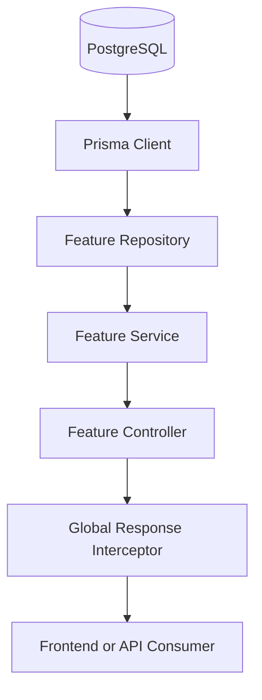
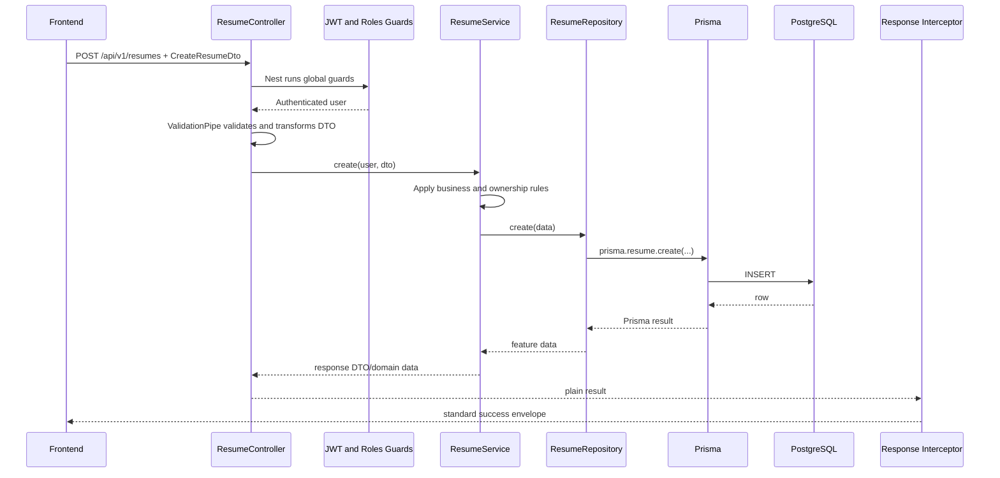
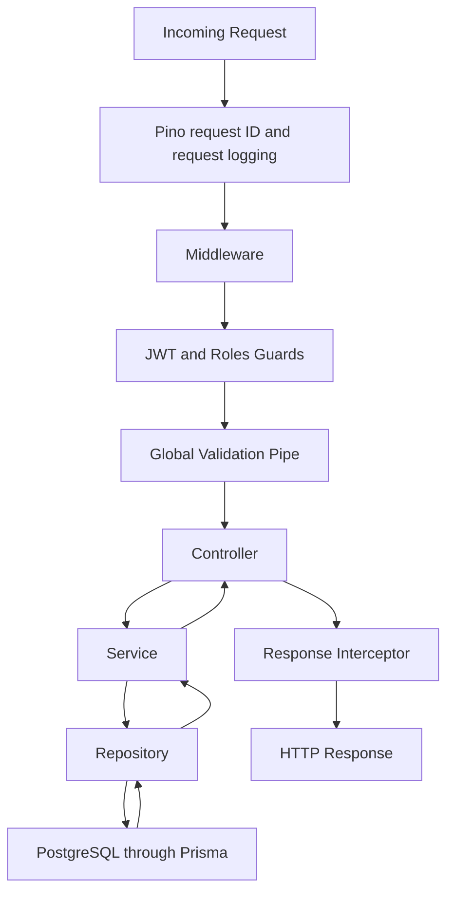
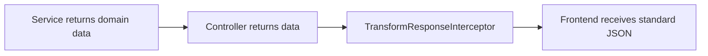
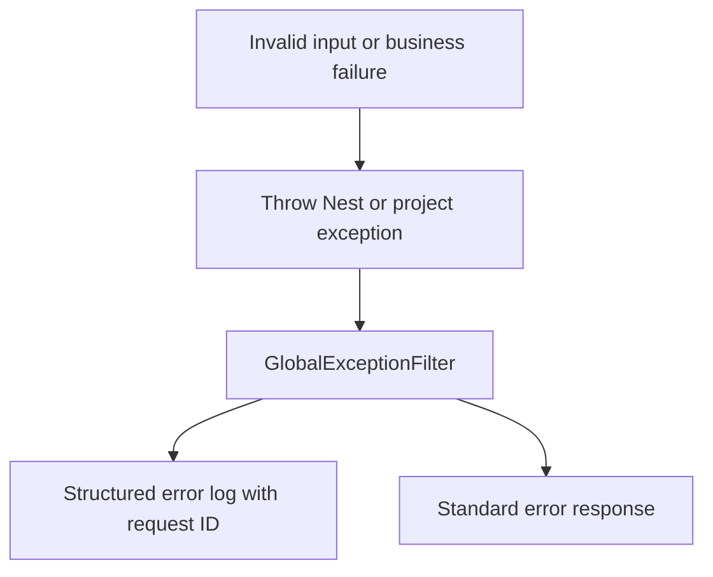
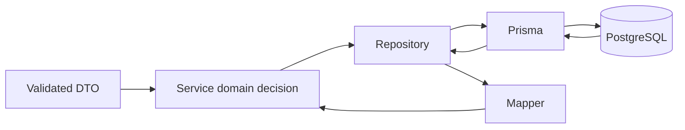
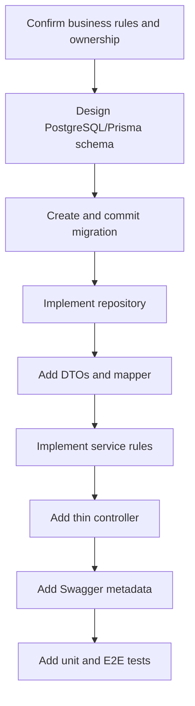
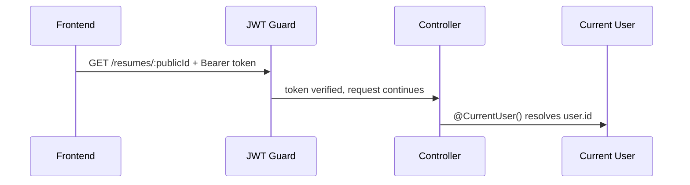

# Writing Business Code in Manage-R

Manage-R is a modular NestJS backend for resume management and career tracking.
This handbook explains how to add backend business code without breaking the
project's conventions.

Read this before creating a module, endpoint, database query, DTO, or business
rule. It is intentionally practical: follow the patterns here unless there is
a clear, reviewed reason not to.

> [!NOTE]
> The repository is currently a foundation. Several feature modules are still
> placeholders. This guide describes the architecture those modules must follow
> as they become real features.

## Project philosophy

- Build a modular monolith, not microservices.
- PostgreSQL is the source of truth.
- Prisma performs database persistence.
- Each feature owns its controller, service, repository, DTOs, and mappers.
- Controllers coordinate HTTP. Services own business decisions.
- Repositories own persistence queries. They stay thin.
- Cross-cutting behavior belongs in `common/`, `config/`, or `database/`.
- Prefer obvious, testable code over clever abstractions.

## Goals

- Keep changes easy to review.
- Make authorization and ownership checks hard to forget.
- Return consistent API responses.
- Keep database details out of controllers and services.
- Make future modules look familiar to every contributor.

---

# Big Picture



### PostgreSQL

PostgreSQL stores durable application data. It is the authoritative source for
users, resumes, career records, public resume IDs, and future audit data.

Primary keys are `BIGINT`. Publicly shared resumes additionally use a UUID
`public_id`; do not expose an internal resume ID as a public sharing identifier.

### Prisma Client

Prisma translates repository queries into PostgreSQL operations. It is provided
by the global `PrismaService`; do not instantiate `PrismaClient` yourself.

### Feature repository

A repository contains focused reads and writes for one feature. It receives
Prisma through dependency injection and returns persistence/domain data to its
service.

### Feature service

A service is where the application decides what should happen. It applies
business rules, ownership rules, transactions, and feature-level coordination.

### Feature controller

A controller maps HTTP to a service method. It reads parameters and DTOs,
passes the authenticated user when needed, and returns the service result.

### Response interceptor

Controllers return data, not response envelopes. The global interceptor wraps
successful results into the project response format automatically.

---

# Complete Request Flow

Imagine a user clicks **Create Resume**.



The practical order is:

1. The frontend sends an HTTP request.
2. Pino assigns a request ID and records safe request metadata.
3. Middleware performs request-wide technical work.
4. Guards authenticate and authorize the request.
5. The global validation pipe validates DTO input.
6. The controller calls exactly one appropriate service method.
7. The service applies business rules and calls repositories.
8. The repository uses Prisma to persist or read data.
9. The service returns a safe result to the controller.
10. The response interceptor creates the success envelope.

> [!TIP]
> If a step feels hard to place, ask: “Is this about HTTP, business decisions,
> or persistence?” That answer normally identifies the correct layer.

---

# Folder Structure

```text
src/
├── common/                 Shared cross-cutting building blocks
├── config/                 Validated application configuration
├── database/               Prisma integration and repository base helpers
├── modules/                Feature modules
│   └── resume/             One feature and its internal layers
└── main.ts                 Application bootstrap

prisma/
└── schema.prisma           PostgreSQL schema and Prisma generator
```

| Location | Purpose |
|---|---|
| `modules/` | Feature boundaries such as users, profiles, resumes, education, and job applications. |
| `modules/<feature>/dto/` | Request and response DTOs for that feature. Create it when the feature needs DTOs. |
| `modules/<feature>/*.repository.ts` | Prisma-backed persistence access for the feature. |
| `modules/<feature>/mappers/` | Explicit conversion between Prisma/domain data and API-safe response data. |
| `common/` | Shared decorators, exceptions, guards, pipes, interceptors, validators, interfaces, constants, and utilities. |
| `config/` | `AppConfigModule`, Joi environment validation, and `AppConfigService`. |
| `database/` | Global `PrismaService` and reusable repository helpers. |
| `prisma/` | Prisma schema and committed database migrations. |
| `common/decorators/` | Reusable metadata and parameter decorators such as `@Public()`, `@CurrentUser()`, and `@Roles()`. |
| `common/guards/` | JWT authentication and role authorization guards. |
| `common/filters/` | Global error-to-response conversion. |
| `common/interceptors/` | Global response formatting. |
| `common/validators/` | Reusable class-validator constraints such as strong-password validation. |
| `common/interfaces/` | Shared TypeScript contracts, for example pagination and authenticated users. |
| `common/utils/` | Small stateless helpers such as pagination, hashing, and HTTP log formatting. |

> [!WARNING]
> Do not create a generic `helpers/` or `services/` dumping ground. Put code in
> the feature that owns it, or in `common/` only when it is genuinely shared.

---

# Responsibilities of Each Layer

| Layer | Purpose | Allowed | Not Allowed | Example |
|---|---|---|---|---|
| DTO | Define and validate an API contract | class-validator decorators, Swagger metadata, input transformation | Database calls, authorization, business rules | `CreateResumeDto` |
| Controller | Adapt HTTP to a service call | route decorators, DTOs, params, `@CurrentUser()` | Prisma calls, calculations, ownership rules | `create(dto, user)` |
| Service | Apply feature business rules | authorization decisions, orchestration, transactions, exceptions | HTTP response shaping, raw SQL | `createResume()` |
| Repository | Read and write feature data | Prisma queries, query-specific selection, pagination | business policy, HTTP concerns | `findOwnedById()` |
| Prisma | Persist data | schema relations, migrations, generated client operations | API response formatting | `prisma.resume.create()` |
| Middleware | Observe/request-wide technical work | correlation, logging setup, transport concerns | feature rules, database decisions | Pino request context |
| Guard | Decide if a request may continue | JWT validation, role checks | database mutations, response formatting | `JwtAuthGuard` |
| Interceptor | Transform successful HTTP output | standard envelope, timing/cross-cutting response work | business decisions | `TransformResponseInterceptor` |
| Filter | Handle thrown errors | standard error envelope, structured error log | success formatting, recovery business rules | `GlobalExceptionFilter` |
| Decorator | Attach reusable route metadata or extract request data | `@Public()`, `@Roles()`, `@CurrentUser()` | application logic | `@Roles(Role.ADMIN)` |
| Mapper | Create safe output shape | BIGINT-to-string conversion, field selection | database calls, hidden business policy | `toResumeResponse()` |

---

# Life of an HTTP Request



### Incoming request

Nest receives the request under the `/api/v1` prefix. Do not add a duplicate
version segment inside individual controller paths.

### Middleware and Pino

Pino assigns or preserves `X-Request-Id`, returns it as a response header, and
logs only safe request metadata. No feature-specific work belongs here.

### Guards

The global JWT guard protects routes by default. Use `@Public()` only for
intentional public endpoints, such as health, API metadata, login, or a future
public resume page.

The roles guard enforces `@Roles(...)` where role-based access is needed.

### Validation pipe

The global pipe transforms input, strips unapproved properties, and rejects
unapproved input. Controllers should receive already validated DTO instances.

### Controller, service, repository, database

These layers perform the feature work in that order. Keep the direction one
way: controller → service → repository → Prisma.

### Interceptor and response

The interceptor wraps success responses. The global exception filter handles
errors instead, so errors do not pass through the success response path.

---

# DTO

A Data Transfer Object (DTO) is the explicit contract at the API boundary.
It tells contributors, Swagger, and validation exactly what a client may send.

## Why DTOs exist

- Prevent unexpected client fields from becoming database fields.
- Convert safe input types, for example query strings to numbers.
- Document endpoints in Swagger.
- Keep controllers and services strongly typed.
- Separate create and update rules clearly.

## DTO rules

- Name classes with a purpose: `CreateResumeDto`, `UpdateProfileDto`.
- Put them in `modules/<feature>/dto/`.
- Add `class-validator` decorators to every client-controlled field.
- Add `@ApiProperty()` or `@ApiPropertyOptional()` for Swagger.
- Use `@Type(() => Number)` for validated numeric query fields when needed.
- Use separate create, update, filter, and response DTOs when their rules differ.
- Never use a Prisma model as a request DTO.

### Good DTO

```ts
export class CreateResumeDto {
  @ApiProperty({ example: 'Software Engineer Resume' })
  @IsString()
  @Length(1, 120)
  title!: string;
}
```

### Bad DTO

```ts
// Bad: database-shaped, no validation, lets the client control ownership.
export class ResumeDto {
  id!: bigint;
  userId!: bigint;
  title!: string;
  createdAt!: Date;
}
```

> [!WARNING]
> A client must never submit `userId`, `ownerId`, role fields, timestamps, or
> internal identifiers to claim ownership. Derive ownership from `@CurrentUser()`.

---

# Controller

Controllers should be boring. A reviewer should understand one quickly.

## Controllers may

- Receive route, query, body, and authenticated-user values.
- Declare Swagger metadata.
- Call a service.
- Return the service result unchanged.
- Select a clear HTTP status code when needed.

## Controllers must not

- Call Prisma directly.
- Contain business branching or complex calculations.
- Check ownership manually.
- Hash passwords.
- Build the standard success response envelope.
- Catch exceptions only to rethrow the same exception.

```ts
@Post()
create(@CurrentUser() user: IAuthenticatedUser, @Body() dto: CreateResumeDto) {
  return this.resumeService.create(user, dto);
}
```

---

# Service

Services are where Manage-R business logic belongs.

## Typical service responsibilities

- Create a resume for the current user.
- Enforce resume ownership before reading or updating it.
- Create a resume version according to versioning rules.
- Track a job application and valid status changes.
- Select a permitted resume template.
- Check rules that require current database state.
- Coordinate more than one repository in a transaction.
- Throw project exceptions such as `NotFoundException` or `ConflictException`.

## Service pattern

```ts
async update(user: IAuthenticatedUser, resumeId: bigint, dto: UpdateResumeDto) {
  const resume = await this.resumeRepository.findOwnedById(resumeId, user.id);

  if (!resume) {
    throw new NotFoundException('Resume not found.');
  }

  return this.resumeRepository.update(resumeId, dto);
}
```

> [!TIP]
> “Does the user own this resume?” is a business/security rule. The service
> decides that it must be checked; the repository provides an efficient query
> such as `findOwnedById` to perform it.

---

# Repository

A repository hides Prisma query details from the service.

## Repository responsibilities

- Use injected `PrismaService` only.
- Query the tables owned by its feature.
- Select only fields the service needs.
- Implement database pagination, sorting, filtering, and transactions passed in.
- Return data or `null` when a record does not exist.

## Repository rules

- Keep methods named for intent: `findByEmail`, `findOwnedById`, `create`.
- Do not decide whether an operation is allowed.
- Do not throw HTTP-shaped exceptions for normal missing data.
- Do not call another feature's service from a repository.
- Do not expose raw Prisma models beyond the repository boundary.

The existing `BaseRepository` offers pagination helpers. It is not permission to
force every feature into generic CRUD. Add focused repository methods whenever
the domain needs them.

---

# Prisma

Prisma is the persistence implementation, not the application architecture.

- Access it through injected `PrismaService` inside repositories.
- Keep `schema.prisma` aligned with PostgreSQL and committed migrations.
- Use `BigInt` for database primary keys.
- Convert BIGINT values to strings in response mappers/DTOs before JSON output.
- Define indexes and unique constraints in the schema, not in service code.
- Use `$transaction` only when multiple writes must succeed or fail together.

> [!WARNING]
> `JSON.stringify()` cannot serialize JavaScript `bigint`. Never return a raw
> Prisma BIGINT field directly from an API endpoint.

---

# Authentication Flow

```mermaid
flowchart TD
    A[Request] --> B{Public route?}
    B -- Yes --> E[Controller]
    B -- No --> C[JWT Guard]
    C --> D[Token validation]
    D --> F[request.user]
    F --> G[@CurrentUser()]
    G --> E
    E --> H[Service]
```

## JWT

JWT authentication is global. Access tokens are validated by `JwtStrategy` and
the resulting authenticated user is attached to `request.user`.

## Current user

Use `@CurrentUser()` in controllers instead of reaching into Express request
objects. It returns the project's authenticated-user contract.

## Roles and permissions

Use `@Roles(Role.ADMIN)` for coarse role restrictions. Use service-level
ownership checks for resource-level permissions.

## Public and protected routes

- Protected is the default.
- `@Public()` is an explicit exception.
- Public does not mean unrestricted database access; validate and rate-limit it.

---

# Authorization Flow

Authorization happens at two levels.

| Question | Preferred mechanism |
|---|---|
| Is the caller authenticated? | Global JWT guard |
| Does the caller have an admin role? | `@Roles()` and `RolesGuard` |
| Does the caller own this resume or profile? | Service rule plus ownership-scoped repository query |
| May an admin manage another user's record? | Explicit service policy |
| Does a future permission model allow this action? | Feature authorization service/policy, not controller conditionals |

### Normal user

A normal user may read and change only resources they own, unless a feature
explicitly supports sharing.

### Admin

An admin may receive broader access only when a concrete rule grants it. Do not
silently treat all role checks as ownership bypasses.

### Future RBAC

The current role enum and roles guard provide a simple starting point. If more
fine-grained permissions are needed, evolve the service policy while keeping
controllers thin and repositories persistence-only.

---

# Response Flow



Services return useful data. Controllers do not manually write `{ success,
message, data }` unless a custom message is deliberately required by the
existing interceptor convention.

```json
{
  "success": true,
  "message": "Operation completed successfully.",
  "data": {
    "id": "42",
    "title": "Software Engineer Resume"
  }
}
```

---

# Error Flow



Use project exceptions from `common/exceptions/` for expected business failures.

- `BadRequestException`: request is valid JSON but violates a business rule.
- `NotFoundException`: requested resource does not exist or is not visible.
- `ConflictException`: unique or state conflict.
- `UnauthorizedException`: missing or invalid authentication.
- `ForbiddenException`: authenticated but not permitted.
- `UnprocessableEntityException`: semantically invalid input where appropriate.

The global filter logs failures and creates this shape:

```json
{
  "success": false,
  "statusCode": 404,
  "message": "Resume not found.",
  "timestamp": "2026-08-07T12:00:00.000Z",
  "path": "/api/v1/resumes/42"
}
```

> [!WARNING]
> Never return stack traces, SQL errors, tokens, passwords, or raw unexpected
> error details to API clients.

---

# Database Flow



Data should move deliberately:

1. A DTO represents client input.
2. A service combines input with trusted context, such as the current user ID.
3. A repository builds the Prisma input and executes it.
4. A mapper removes persistence-only fields and serializes BIGINT IDs safely.
5. The service returns an API-safe object.

Never let a client DTO become a Prisma `data` object without review. The service
must choose which fields are allowed to reach persistence.

---

# Coding Rules

Use this review checklist while writing code.

- [ ] Keep controllers small.
- [ ] Put business rules in services.
- [ ] Keep repositories limited to persistence queries.
- [ ] Validate client input with DTOs.
- [ ] Throw project exceptions for expected failures.
- [ ] Never expose Prisma models directly.
- [ ] Never return password hashes, tokens, or secrets.
- [ ] Serialize BIGINT IDs as strings in API output.
- [ ] Keep methods focused and short.
- [ ] Prefer composition over inheritance-heavy abstractions.
- [ ] Use dependency injection for services and repositories.
- [ ] Give each method one responsibility.
- [ ] Scope data queries to the current user where ownership matters.
- [ ] Use transactions for atomic multi-write business operations.
- [ ] Add Swagger documentation alongside each endpoint.
- [ ] Preserve standard response and error formats.

---

# Naming Convention

Use names that reveal feature and intent.

| Concern | Convention | Examples |
|---|---|---|
| DTO | `<Action><Feature>Dto` | `CreateResumeDto`, `UpdateResumeDto` |
| Service | `<Feature>Service` | `ResumeService` |
| Repository | `<Feature>Repository` | `ResumeRepository` |
| Controller | `<Feature>Controller` | `ResumeController` |
| Module | `<Feature>Module` | `ResumeModule` |
| Mapper | `<Feature>Mapper` or clear function | `toResumeResponse` |
| Find method | `findBy...` or `findOwnedBy...` | `findById`, `findOwnedById` |
| Command method | action verb | `createResume`, `updateResume`, `deleteResume` |
| Boolean method | question form | `canEditResume`, `isPublic` |

Use plural controller route nouns consistently for collection resources, such as
`resumes`, `projects`, and `certifications`.

---

# Feature Development Workflow

Suppose the next feature is **Certification**.



## Recommended implementation order

1. Write the feature's rules, ownership model, and API contract first.
2. Add Prisma model changes, indexes, and a reviewed migration.
3. Implement repository methods needed by the service.
4. Add DTOs with validation and Swagger metadata.
5. Add mappers for safe output.
6. Implement service methods and business exceptions.
7. Add controller routes and decorators.
8. Add authorization cases.
9. Add tests before considering the feature complete.
10. Verify Swagger and the standard response/error envelopes manually.

> [!TIP]
> Do not start with the controller. Starting with the data model and business
> rules prevents a route from becoming the accidental design document.

---

# Example Development Checklist

Before opening a pull request for any module, review all of these.

## Database

- [ ] Model fields, relations, indexes, and constraints are correct.
- [ ] IDs follow the BIGINT policy.
- [ ] Public identifiers use UUIDs only where required.
- [ ] Migration is committed and reversible in practice.

## Repository

- [ ] Queries are focused and ownership-aware where needed.
- [ ] Pagination uses the shared pagination conventions.
- [ ] No business policy is embedded in repository methods.

## DTO and mapper

- [ ] Every client field is validated.
- [ ] Swagger properties are present.
- [ ] Input cannot set ownership or privileged fields.
- [ ] Output does not leak internal or sensitive fields.
- [ ] BIGINT fields are serialized safely.

## Service and controller

- [ ] Business rules live in the service.
- [ ] Controller only adapts HTTP to the service call.
- [ ] Authorization covers roles and ownership.
- [ ] Expected failures use project exceptions.
- [ ] Endpoint appears correctly in Swagger.

## Operations and review

- [ ] Sensitive values are never logged.
- [ ] Important business events have appropriate audit/logging treatment.
- [ ] Unit and E2E tests cover happy paths and failures.
- [ ] `npm run lint` passes.
- [ ] `npm run build` passes.
- [ ] API response and error envelopes match project conventions.

---

# A Real Example: Fetching a Resume

> [!NOTE]
> The `ResumeModule` is still a placeholder in the repository. The endpoint below
> is the intended implementation using the project's real decorators, exceptions,
> response interceptor, and Prisma schema. Treat every code block as
> example/representative until the feature is built.

This section walks one complete endpoint end to end: **fetch a single resume by
its public UUID**.

**The requirement, in plain words:** a logged-in user wants to fetch one of their
own resumes.

```text
GET /api/v1/resumes/550e8400-e29b-41d4-a716-446655440000
```

Why `publicId` and not the BIGINT `resume_id`? The internal `resume_id` is a
database implementation detail; `public_id` is the UUID the app is allowed to
share. One user must never fetch another user's resume, so the endpoint must
prove who is asking (authentication) and check that the resume belongs to them
(authorization).

The whole path: Frontend → HTTP → Authentication → DTO → Controller → Service →
Repository → Prisma → PostgreSQL → Mapper → Response → Frontend.

## 1. Start with the requirement

- `publicId` is used instead of the BIGINT `resume_id` — it is the safe, shareable identifier.
- Users must not access another user's resume.
- Authentication (`Authorization: Bearer ...`) identifies the current user.
- The service verifies ownership before returning data.
- The repository fetches the data, with the ownership rule baked into the query.

## 2. The database relationship (only what this endpoint needs)

```text
sec_user
   │  (user_id)
   └── profile
          │  (profile_id)
          └── resume
                 ├── resume_skill
                 ├── resume_education
                 ├── resume_experience
                 ├── resume_project
                 └── resume_certification
```

A user owns exactly one profile, a profile owns many resumes, and each resume
links to its sections through the `resume_*` join tables. Ownership is the
`sec_user → profile → resume` chain.

## 3. The HTTP request

```http
GET /api/v1/resumes/550e8400-e29b-41d4-a716-446655440000
Authorization: Bearer <access-token>
```

- `/api/v1` is added globally; the controller only declares `/resumes/:publicId`.
- `:publicId` is the resume's public UUID.
- `Authorization: Bearer <access-token>` carries the signed JWT that proves who the caller is.

## 4. DTO / parameter validation

Nest parses the path parameter before any controller logic runs. Manage-R validates
route parameters with the shared `ParseUuidPipe` (in `common/pipes/`), which rejects
anything that is not a well-formed UUID v4 with a 400:

```ts
@Get(':publicId')
findOne(
  @Param('publicId', ParseUuidPipe) publicId: string,
  @CurrentUser() user: IAuthenticatedUser,
) {
  return this.resumeService.findByPublicId(publicId, user.id);
}
```

Bad input fails fast at the boundary, before we ever touch the database. Only
valid input reaches the service.

## 5. The controller

`ResumeController` (`modules/resume/resume.controller.ts`) — intended shape:

```ts
@ApiTags('Resume')
@Controller('resumes')
export class ResumeController {
  constructor(private readonly resumeService: ResumeService) {}

  @Get(':publicId')
  findOne(
    @Param('publicId', ParseUuidPipe) publicId: string,
    @CurrentUser() user: IAuthenticatedUser,
  ) {
    return this.resumeService.findByPublicId(publicId, user.id);
  }
}
```

The controller receives the request and passes validated input plus the
authenticated user to the service. It does **not** query PostgreSQL itself.

## 6. The authentication flow



- The JWT guard verifies the access token and attaches the identity to the request.
- `@CurrentUser()` makes that identity available to the controller.
- The client never tells us which user owns the resume.

> [!WARNING]
> Never trust a `userId` from the request body, a query parameter, or the URL.
> The authenticated identity comes only from the verified token.

## 7. The service

`ResumeService` (`modules/resume/resume.service.ts`) — representative:

```ts
async findByPublicId(publicId: string, userId: string) {
  const resume = await this.resumeRepository.findByPublicIdAndUserId(publicId, userId);

  if (!resume) {
    throw new NotFoundException('Resume not found.');
  }

  return toResumeResponse(resume);
}
```

The service receives the `publicId` and the authenticated `userId`, applies the
ownership rule by passing both to the repository, handles "not found", and maps
the result before returning it.

- **Authentication answers:** "Who are you?"
- **Authorization answers:** "Are you allowed to access this resume?"

## 8. The repository

`ResumeRepository` (`modules/resume/resume.repository.ts`) — representative:

```ts
async findByPublicIdAndUserId(publicId: string, userId: string) {
  return this.prisma.resume.findFirst({
    where: {
      public_id: publicId,
      profile: { user_id: BigInt(userId) },
    },
    include: { ... },
  });
}
```

The query ensures **both**: the `public_id` matches **and** the resume's profile
belongs to the authenticated user. The repository knows how to retrieve data; it
does not decide whether access is allowed — the service made that decision by
requesting this ownership-scoped method.

## 9. The Prisma query

Using the real model and relation names from `prisma/schema.prisma`:

```ts
this.prisma.resume.findFirst({
  where: {
    public_id: publicId,
    profile: { user_id: BigInt(userId) },
  },
  include: {
    resume_skill: {
      include: { profile_skill: { include: { master_skill: true } } },
    },
    resume_education: true,
    resume_experience: {
      include: { experience_responsibility: { orderBy: { display_order: 'asc' } } },
    },
    resume_project: true,
    resume_certification: true,
  },
});
```

`findFirst` returns `null` when nothing matches, so "not found" is a natural
result of the query. `user_id` is a BIGINT column, so the string id is converted
with `BigInt(userId)` before Prisma runs the query.

## 10. The database result

PostgreSQL returns rows; Prisma converts them into a plain TypeScript object — a
`resume` with nested `resume_skill`, `resume_education`, and other arrays. The
service never sees raw SQL; it sees structured data.

## 11. Mapping

Database structure and API response structure do not have to be identical. A
mapper converts persistence shape to API shape:

```text
Database:          API:
resume_id          id
public_id          publicId
resume_category_id category
```

Representative mapper (`modules/resume/mappers/`):

```ts
export function toResumeResponse(resume: ResumeWithRelations): ResumeResponseDto {
  return {
    id: resume.resume_id.toString(),
    publicId: resume.public_id,
    title: resume.title,
    skills: resume.resume_skill.map((rs) => ({
      name: rs.profile_skill.master_skill.skill_name,
    })),
    education: resume.resume_education.map(/* ... */),
  };
}
```

BIGINT values are converted to strings here so JSON serialization never breaks.

## 12. The final response

The global `TransformResponseInterceptor` wraps the service result automatically:

```json
{
  "success": true,
  "message": "Operation completed successfully.",
  "data": {
    "id": "42",
    "publicId": "550e8400-e29b-41d4-a716-446655440000",
    "title": "Backend Developer Resume",
    "skills": [],
    "education": [],
    "experience": [],
    "projects": [],
    "certifications": []
  }
}
```

The controller returns plain data; the interceptor adds the `success`, `message`,
`data` envelope.

## 13. The complete flow

```text
Frontend
   │
   │ GET /resumes/:publicId
   ▼
JWT Guard
   │
   ▼
Controller
   │
   ▼
DTO validation
   │
   ▼
ResumeService
   │
   │ publicId + authenticated userId
   ▼
ResumeRepository
   │
   ▼
Prisma
   │
   ▼
PostgreSQL
   │
   ▼
Prisma result
   │
   ▼
Mapper
   │
   ▼
Service
   │
   ▼
Controller / Interceptor
   │
   ▼
JSON Response
   │
   ▼
Frontend
```

1. The frontend sends `GET /resumes/:publicId` with a Bearer token.
2. The JWT guard verifies the token and attaches the user identity.
3. The controller validates `publicId` and calls the service with it plus `user.id`.
4. The service asks the repository for a resume matching the publicId **and** the user.
5. Prisma executes the query in PostgreSQL; the result returns as a typed object.
6. The service maps the result to an API-safe shape (BIGINTs as strings).
7. The interceptor wraps the data in the standard envelope and returns it to the frontend.

## 14. When you build a new endpoint

- 1. What data does the endpoint need?
- 2. What DTO validates the input?
- 3. Is authentication required?
- 4. Who is allowed to access the resource?
- 5. What business rule belongs in the service?
- 6. What database operation belongs in the repository?
- 7. Does the response need mapping?
- 8. What should the frontend receive?
- 9. What errors can occur?

---

# Common Mistakes

| Mistake | Why it hurts | Better approach |
|---|---|---|
| Business logic in a controller | Hard to test and easy to duplicate | Move decisions to the service |
| Prisma/SQL inside a service | Couples business logic to persistence details | Add a focused repository method |
| Returning a Prisma model | Leaks schema and breaks on BIGINT JSON values | Map to an API response shape |
| Skipping DTOs | Bypasses validation and Swagger clarity | Define a specific DTO |
| Duplicating validation | Rules drift between endpoints | Reuse DTOs or custom validators |
| Large methods | Hide multiple responsibilities | Extract meaningful private methods/services |
| Large “god” services | Feature boundaries disappear | Split by domain responsibility when justified |
| Client-supplied ownership IDs | Enables privilege escalation | Use authenticated user context |
| `@Public()` by default | Accidentally exposes endpoints | Keep protected-by-default policy |
| Catching every error in a controller | Bypasses global error handling | Throw meaningful exceptions and let the filter work |
| Logging raw request objects | Can leak credentials and personal data | Use Pino's safe structured fields |
| Creating generic abstractions too early | Makes simple features harder to understand | Add abstraction only after a repeated proven need |

---

# Golden Rules

1. Controllers coordinate.
2. Services think.
3. Repositories store and retrieve.
4. Prisma persists.
5. DTOs validate the API boundary.
6. Mappers make output safe.
7. Interceptors format successful responses.
8. Filters handle failures.
9. Guards protect routes.
10. Middleware observes cross-cutting request concerns.
11. Treat all client input as untrusted.
12. Keep protected routes protected by default.
13. Check ownership in services for user-owned resources.
14. Never expose passwords, tokens, secrets, or raw database errors.
15. Never return raw BIGINT values in JSON.
16. Keep functions small and names explicit.
17. Prefer readable code over clever code.
18. Prefer consistency over shortcuts.
19. Do not duplicate validation or response formatting.
20. Use dependency injection; do not manually construct services or Prisma clients.
21. Keep logging structured, safe, and useful for operations.
22. Add tests with every meaningful behavior change.
23. Commit migrations with schema changes.
24. When unsure, follow the closest existing feature pattern.

This handbook is the default way to write backend code in Manage-R. Improve it
when a real, repeated project need teaches us a better pattern.
